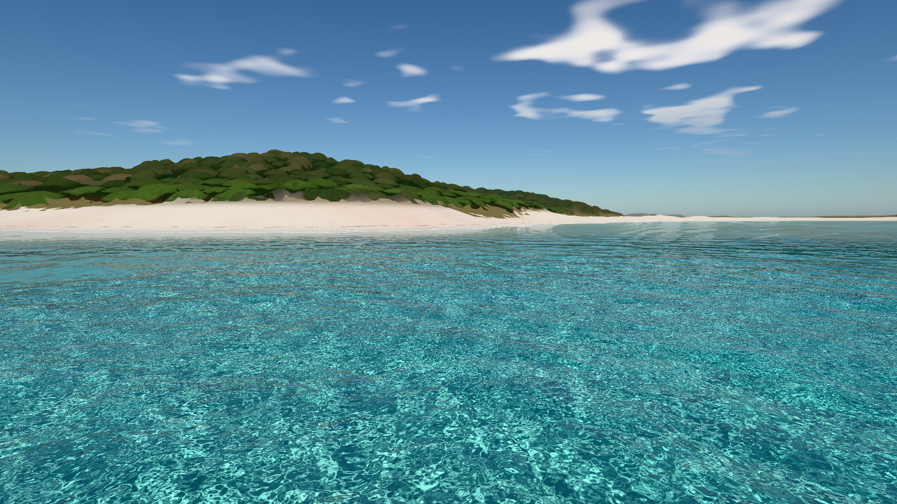
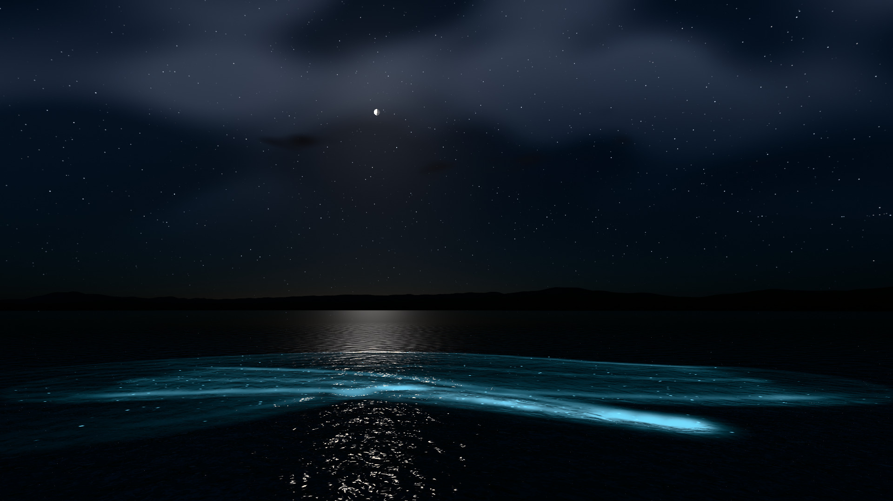
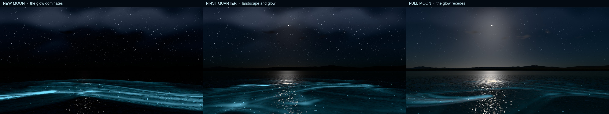

# ClearVieques

*A spectral water study on Vieques* — a real-time **WebGPU** shallow-water demo over **real NOAA topo-bathy** of Vieques, Puerto Rico. Two linked modes on one renderer: **Playa Caracas by day** and **Mosquito Bay by night**, where the water glows blue-green wherever it is disturbed.

**[Live demo → webgpu-demos.github.io/clear-Vieques](https://webgpu-demos.github.io/clear-Vieques/)** (needs a WebGPU-capable browser; the first load reads a ~6 MB terrain file). Deep links: [`?site=mosquito&mode=night`](https://webgpu-demos.github.io/clear-Vieques/?site=mosquito&mode=night) · [`?site=caracas&mode=day`](https://webgpu-demos.github.io/clear-Vieques/?site=caracas&mode=day)





## What it does

* **Water optics, all on the GPU:** three tiled FFT cascades (JONSWAP wind sea + swell, finite-depth and capillary dispersion, crest-sharpening, Jacobian whitecaps), exact Fresnel with Smith shadowing of the reflected ray, per-channel Beer–Lambert absorption (Jerlov I → 9C), a refracted **real seabed**, caustics splatted onto that seabed, foam, and interactive ripples.
* **Playa Caracas (day):** white-to-pink sand, jade-to-blue water, forested headland, small surf running up the beach, cloud shadows drifting across the bay; shallow terrace, crescent, islet and sand spit straight from the DEM. Three OSM picnic shelters are drawn at their real footprints.
* **Mosquito Bay (night):** the enclosed lagoon and its narrow inlet from the DEM, a mangrove fringe grown along the lagoon's real shoreline, a physical moon (Allen's phase law, true phase shape on the disc), procedural stars and Milky Way, dark-adapted grading — and **Pyrodinium-style bioluminescence**: blue-green light and sparks where the surface is disturbed by your paddle, by camera motion (the camera is a boat with a bow wave), by ripples you click, and by breaking waves.
* **The moon-phase slider changes how visible the glow is**, physically: a thin moon lets the eye (and the exposure) adapt, so the same stroke pops at new moon and recedes at full moon.



## Run it

Needs a WebGPU-capable browser. Developed and verified in Chrome 152 on an Apple M3 (from `http://localhost`, straight from `file://`, and on GitHub Pages); other browsers/GPUs are untested.

```bash
# any of these
open index.html                      # works straight from disk (classic scripts + data/terrain.js, no fetch, no modules)
node tools/serve.mjs                 # http://localhost:8137/
python3 -m http.server 8137
```

URL flags: `?site=caracas|mosquito` · `?mode=day|night` · `?ui=0` (hide the panel) · `?t=12` (freeze the wave clock) · `?scale=0.75` (fix the render scale, disables the adaptive ladder) · `?quality=0|1|2` · `?debug=1..7` (1 normals, 2 depth, 3 caustic map, 4 foam, 5 refraction only, 6 reflection only, 7 land classes) · `?hold=1` (boot, then stop: capture the very first frame) · `?nocrown=1` (terrain without canopy displacement) · `?taa=0` (temporal anti-aliasing off) · `?bloom=0` (no glow around highlights).

Reproducible screenshot / smoke test (headless Chrome, no dependencies): `node tools/shot.mjs "file://$PWD/index.html" out.png --w 1920 --h 1080`.

## Controls

| | |
|---|---|
| **Drag** | look (fly) / orbit |
| **W A S D**, **Q / E** | fly, down / up (**Shift** ×4, **Ctrl** slow, **wheel** = speed) |
| **O** | toggle fly ⇄ orbit (orbit: **wheel** dolly, **right-drag / Shift-drag** pan) |
| **Click** the water | ripple (splash + foam; at night, a burst of glow) |
| **X** / *Paddle* | paddle mode: a ring marks the blade, drag over the water to stroke it |
| **N** / *Day · Night* | switch the light between sun and moon on the current site |
| **V** / *Hero view* | screenshot-ready pose for the current mode |
| **P**, **R**, **H** | pause, reset, hide UI |

Panel: location tabs (**Playa Caracas · Mosquito Bay**), **Sun / Moon elevation**, **Exposure**, **Moon phase** (night), **Depth offset** (sea level vs. the DEM), **Wave energy**, **Wind**, **Turbidity · Jerlov**, **Day / Night**, **Reset**, **Pause**, **Hero view**, **Fly**, **Paddle**. The HUD shows fps, GPU ms, render size, scale, quality tier and the live camera lat/lon.

## What is real, what is procedural

* **Real (NOAA NCEI CUDEM 1/9″, 4 m near grid + 20 m far grid):** all seabed and land elevation. Waterlines, depths, crescents, headlands, the islet, the lagoon and its inlet come from the data. The lagoon's mangrove zone is a distance field from a flood-fill of the DEM's enclosed water (cut at the inlet neck). Shelters and dirt tracks come from OpenStreetMap.
* **Procedural (on top of the real heightfield):** the forest (CUDEM is bare-earth) — a compute pass classifies the terrain and bakes crown centres, heights and ids; the near mesh (2 m cells) is lifted by them, every crown is an elliptical dome, and each crown pixel gets leaf-cluster structure (slope, occlusion, tint) from a CPU-baked, mip-mapped foliage texture, sun shadows from neighbouring crowns, leaf translucency and sheen, and a frayed skyline. Also: sand and seagrass classes, clouds, stars, the moon's maria, the wave spectrum's fine scales.
* **Sites:** Playa Caracas 18.1120° N, 65.3841° W (the crescent's waterline midpoint; the brief's 18.108 N, 65.386 W falls ~490 m offshore). Mosquito Bay 18.1020° N, 65.4451° W (lagoon centroid).

## Performance

The frame is cheap by construction: waves 1.5 ms, ripples skipped while settled, the caustic map splatted straight into its 1024² level on the lower tiers and refreshed every other frame on the lowest, the terrain drawn in 32×32-cell tiles that are culled when off-screen or submerged. Resolution adapts along a ladder of `(tier, scale)` rungs driven by GPU timestamp queries, and an **edge-adaptive upscaler** (after AMD FSR 1's EASU, own compact variant) rebuilds clean edges from the low rungs, so MSAA is only used at the top tier. **Temporal anti-aliasing** (jittered projection, depth reprojection, variance-clipped history) runs at the internal resolution before grading, which steadies glitter, foliage and skyline edges in motion. Within ~140 m of the camera the forest is drawn on a 1 m mesh instead of 2 m.

## Iteration log (screenshot critique)

Each round: render, find what is visibly wrong, fix the optics or terrain from the image, keep everything else.

| Round | Found | Fix | Evidence |
|---|---|---|---|
| 1 | Grey-teal water, soft caustics, reflection dashes, foam over the whole terrace, 8 ms caustic pass | exposure/saturation, denser photons, soft reflection coverage, swash-line foam, cost work | `docs/critique/00–10` |
| 2 | Beige **bars** across the shallows at every resolution | Traced (debug views) to the beach reflected in wave backs. Rays that dip below the horizon are mirrored up instead of pinned at the beach's height, Smith shadowing dims low exit angles, and the wind sea's directional spread widens with wavenumber (Elfouhaily-style) | [`11`](docs/critique/11-shoreline-bars-before-after.png) |
| 3 | Stair-stepped edges and dashes at low render scale; ~7 ms of fixed cost | Edge-adaptive upscaler, no MSAA below the top tier, tiled terrain, cheaper caustic tiers, discrete resolution ladder | [`12`](docs/critique/12-low-scale-upscaler.png) |
| 4 | Forest = smeared camouflage, dark rim along ridges, flat beach edge | Baked crowns on a 2 m mesh, dome shading with gaps hidden at grazing angles, per-pixel LOD, trees end at the sand line, crown floor limited to dense stands | [`13`](docs/critique/13-terrain-before-after.png) |
| 5 | One flat-caustic frame at page load | Root cause: the caustic window origin was uploaded before it was computed, so the shader always used the previous frame's. Fixed; frame 0 is now pixel-identical to later frames | — |
| 6 | Night sky read as dusk at full moon; moon disc saturated; vertical seam in the Milky Way | Sky dimmed relative to direct moonlight, earthshine on the dark limb, seam-free star-lane noise | [`16`](docs/critique/16-caracas-night.png) |
| 7 | Crowns still read as smooth rubbery domes: one flat colour each with hard patch edges, no leaf structure, a smooth stair-stepped skyline; from the water roughly half the forest fell back to the flat stand colour (the pixel footprint was stretched by the ground's grazing angle) | A baked leaf-cluster texture (3 octaves, one fetch each, mip level follows the pixel footprint) gives every crown pixel a slope, occlusion and tint; crowns are elliptical and rotated; neighbouring crowns shade each other along the sun ray; leaves transmit backlight and carry a faint sheen; the upper dome edge frays into open sky where the view ray really escapes (painted as sky, not `discard`, which on a tile-based GPU defeats hidden-surface removal: it cost +6–15 ms); foliage footprint no longer stretches at grazing angles | [`17`](docs/critique/17-forest-before-after.jpg) |
| 8 | Forest ended in stepped walls at the beach (sand-coloured polygons); beige bars across the shallows; faceted sand with ripple moire; faceted crowns up close; shimmer in motion; flat distant land | Crown bake takes the tallest neighbouring crown and a continuous tree-line factor slopes the canopy onto the sand, with ground shadows and creepers; downward reflections see the next wave and the sky reflection is averaged over the ripple lobe; smoothed near normals, noisy class edges, footprint-filtered ripples, varied sand; 1 m mesh near the camera with leaf-cluster relief; TAA; directional marine haze. (A 2.5-D cumulus layer was tried and set aside: the original clouds were preferred.) | [`18`](docs/critique/18-scene-round-before-after.jpg) |
| 9 | The waterline was a static white line; glints were hard clipped pixels; clouds cast no shade | Surf: bores every 8.5 s in sets, run-up and backwash on the sand, white water (dense band behind the face, torn lace of varying thickness), none in the lagoon; bloom from light above the tone mapper's shoulder, read before TAA, gentler at night so the crescent survives; cloud shadows on land, water and seabed that drift with the clouds | [`19`](docs/critique/19-surf-bloom-cloud-shadows.jpg) |
| 10 | Seagrass beds were blocky square patches (one octave of value noise thresholded on its lattice); the land was frozen | Beds from domain-warped, rotated octaves, made of ~30 cm shoot clumps with sand between them that thin out over metres at the edges (no hard outline, so small patches no longer read as dark rocks); blades that sway with the surge up close. (Procedural coral heads were tried and removed: as flat seabed texture they read as blobs.) Crowns sway in the wind (gusts travel downwind), leaf clusters flutter, gusts sweep across the grass | [`20`](docs/critique/20-seagrass-before-after.jpg) |
| 11 | Headlands and the islet met the sea in the same sand-and-green as the beach; surf was the same height everywhere; dragging over the panel selected its text | The canopy bake also stores, per 4 m, exposure to the swell and wind sea (open water along a fan of directions, so islets and headlands cast wave shadows) and rockiness (the coast's steepness). Steep shores get rounded granodiorite boulders on the mesh, a dark splash zone that rises with exposure, rocky algae-covered bottom offshore and foam where water washes over them; no trees on them. Surf height follows exposure. The overlay is no longer selectable | [\`21\`](docs/critique/21-rocky-shores-exposure.jpg) |

More: [OSM shelter](docs/critique/14-osm-shelter.png) · [mangroves by day and night](docs/critique/15-mangrove-day-night.png) · earlier stills `docs/caustics.jpg`, `docs/low-sun.jpg`, `docs/sun-glitter.jpg`, `docs/horizon.jpg`.

## Validation and known limits

* GPU wave statistics match the analytic spectrum (`CV.app.waves.expected()` vs `readStats()`: rms height and mean-square slope within ~3 % per cascade), including with the wavenumber-dependent spreading.
* Rendered colour-vs-depth over sand follows the analytic Beer–Lambert prediction (`docs/critique/02-…`): within ~15 % in the bright shallows (tone-mapper compression) and 2–5 % below 6 m.
* Not done: wave refraction/shoaling over the bathymetry (waves are homogeneous FFT tiles with a depth envelope), an underwater camera, mangrove prop roots (the fringe is a canopy wall), moon position by date (the moon's elevation is a slider, not an ephemeris). The `float32-filterable`-less fallback (half-float DEM) exists but is untested. Only tested on Chrome / Apple M3.
* CUDEM is +0.10–0.13 m above the 2019 NGS lidar on average (RMS ≈ 0.2 m); PRVD02 is treated as mean sea level. The "2016 NGS Vieques/Culebra lidar" in the brief does not cover Vieques, and no CUDEM 1/3″ tile exists there, so CUDEM 1/9″ is the only elevation source.

## Layout

```
index.html            page + CSS (dark glass panel)
src/                  util · gpu · sky (CPU atmosphere) · night (moon model) · terrain · waves · ripples · caustics · canopy (forest bake) · foliage (leaf-cluster texture) · taa · bloom
                      structures (OSM shelters) · render · camera · sites · ui · main
src/shaders/          common (shared WGSL: DEM, canopy, sky, stars/moon, waves, ray marchers) · waves (spectrum/FFT) · scene (sky/terrain/water/post)
data/terrain.js       packed DEM grids + OSM for both sites (generated)
data/*.i16 *.json     source grids, metadata, previews, download ledger
tools/                build_terrain.py (NOAA → grids) · pack_terrain.py · terrain_analysis.py · serve.mjs · shot.mjs
docs/                 stills · critique/ (before/after evidence of every round)
PLAN.md               data subset, coordinate frame, day vs night optics
```

Rebuild the data: `python3 tools/build_terrain.py && python3 tools/pack_terrain.py` (needs the GDAL CLI, numpy, scipy, scikit-image, Pillow, tifffile; ≈41 MB download, reproducible bit-for-bit).

## Credits and licences

* Code: **MIT**, © 2026 Jason Matney — see [LICENSE](LICENSE).
* Water look, UI tone and architecture were informed by **[Aureliengmz/clearwater](https://github.com/Aureliengmz/clearwater)** (single-file WebGL2, MIT, © 2026 Lumaris) and **[SamG-Coder/clearwater](https://github.com/SamG-Coder/clearwater)** (CUDA / WebGPU reimplementation, MIT, © 2026 Lumaris). No code, textures, tiles, ducks, tornado or procedural infinite ocean were copied; everything here is written from scratch. Not affiliated with either project.
* Terrain: NOAA NCEI *Continuously Updated Digital Elevation Model (CUDEM) — 1/9 Arc-Second Resolution Bathymetric-Topographic Tiles*, Puerto Rico (public domain; DOI 10.25921/ds9v-ky35). Cross-check: NOAA NGS 2019 topobathy lidar DEM.
* Tracks and shelters © OpenStreetMap contributors (ODbL).
* Algorithms after the literature: Tessendorf (FFT waves), JONSWAP, Elfouhaily et al. (directional spreading), Bruneton et al. (averaged Fresnel), Smith (shadowing), Jerlov (water types), Lee et al. (shallow-water reflectance), Allen (lunar phase law), AMD FidelityFX FSR 1 EASU (edge-adaptive upscaling idea; MIT), Khronos PBR Neutral tone mapper.
