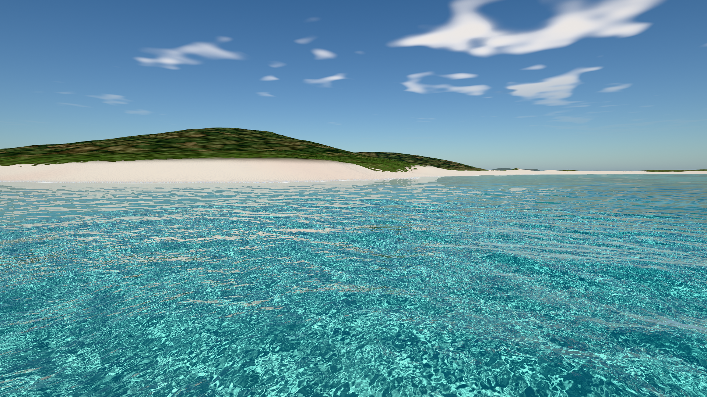

# ClearVieques

*A spectral water study on Vieques* — a real-time **WebGPU** shallow-water demo over **real NOAA topo-bathy** of Vieques, Puerto Rico.

**[Live demo → jasonmatney.github.io/clear-Vieques](https://jasonmatney.github.io/clear-Vieques/)** (needs a WebGPU-capable browser; the first load reads a ~6 MB terrain file).



Playa Caracas (Red Beach) is implemented: FFT spectral waves, exact Fresnel, per-channel Beer–Lambert absorption, a refracted **real seabed**, caustics projected onto that seabed, foam, interactive ripples, sky and land. Mosquito Bay (night, bioluminescence) is the next milestone — its data is packed, the tab is present but disabled.

## Run it

Needs a WebGPU-capable browser. Developed and verified in Chrome 152 on an Apple M3 (from `http://localhost`, straight from `file://`, and on GitHub Pages); other browsers/GPUs are untested.

```bash
# any of these
open index.html                      # works straight from disk (classic scripts + data/terrain.js, no fetch, no modules)
node tools/serve.mjs                 # http://localhost:8137/
python3 -m http.server 8137
```

Reproducible screenshot / smoke test (headless Chrome, no dependencies): `node tools/shot.mjs "file://$PWD/index.html" out.png --w 1920 --h 1080`. Useful URL flags: `?ui=0` (hide the panel), `?t=12` (freeze the wave clock), `?scale=0.75` (fix the render scale), `?debug=1..6` (1 normals, 2 depth, 3 caustic map, 4 foam, 5 refraction only, 6 reflection only).

## Controls

| | |
|---|---|
| **Drag** | look (fly) / orbit |
| **W A S D**, **Q / E** | fly, down / up (**Shift** ×4, **Ctrl** slow, **wheel** = speed) |
| **O** | toggle fly ⇄ orbit (orbit: **wheel** dolly, **right-drag / Shift-drag** pan) |
| **Click** the water | ripple (splash + foam); the sim follows the bathymetry |
| **V** / *Hero view* | screenshot-ready pose: low over the water, looking at the forested headland, sun behind the camera |
| **P**, **R**, **H** | pause, reset, hide UI |

Panel: **Sun elevation**, **Exposure**, **Depth offset** (sea level vs. the DEM, ±m), **Wave energy**, **Wind**, **Turbidity · Jerlov** (I → 9C), **Moon phase** (night mode), **Day / Night**, **Reset**, **Pause**. The HUD shows fps, GPU ms, render size and the live camera lat/lon.

## What is real, what is procedural

* **Real (NOAA NCEI CUDEM 1/9″, 4 m near grid + 20 m far grid):** all seabed and land elevation. Waterline, depths, the beach crescent, headlands, the islet and sand spit come from the data. Nothing about the island shape is invented.
* **Procedural (on top of the real heightfield):** dry-forest canopy (CUDEM is bare-earth), sand/seagrass/hard-ground classes, sand ripples, clouds. OSM tracks are rasterised into the ground material; OSM picnic shelters are not drawn yet.
* Site origin is **18.1120° N, 65.3841° W** — the crescent's waterline midpoint. The approximate coordinates in the brief (18.108 N, 65.386 W) fall ~490 m offshore.

## Validation and known limits

* GPU wave statistics match the analytic spectrum (`CV.app.waves.expected()` vs `readStats()`: rms height and mean-square slope agree within ~3 % per cascade).
* Rendered colour-vs-depth over sand follows the analytic Beer–Lambert prediction (`docs/critique/02-…`): within ~15 % in the bright shallows (tone-mapper compression) and 2–5 % below 6 m.
* Not done: wave refraction/shoaling over the bathymetry (waves are homogeneous FFT tiles with a depth envelope), underwater camera, night mode. The `float32-filterable`-less fallback path (half-float DEM) exists but is untested. Only tested on Chrome / Apple M3.
* CUDEM is +0.10–0.13 m above the 2019 NGS lidar on average (RMS ≈ 0.2 m); PRVD02 is treated as mean sea level.

## Layout

```
index.html            page + CSS (dark glass panel)
src/                  util · gpu · sky (CPU atmosphere) · terrain · waves · ripples · caustics · render · camera · sites · ui · main
src/shaders/          common (shared WGSL: DEM, sky, waves, ray marchers) · waves (spectrum/FFT) · scene (sky/terrain/water/post)
data/terrain.js       packed DEM grids + OSM for both sites (generated)
data/*.i16 *.json     source grids, metadata, previews, download ledger
tools/                build_terrain.py (NOAA → grids) · pack_terrain.py · terrain_analysis.py · serve.mjs · shot.mjs
docs/                 hero stills · critique/ (before/after evidence of the optics loop)
PLAN.md               data subset, coordinate frame, day vs night optics
```

Rebuild the data: `python3 tools/build_terrain.py && python3 tools/pack_terrain.py` (needs the GDAL CLI, numpy, scipy, scikit-image, Pillow, tifffile; ≈41 MB download, reproducible bit-for-bit).

## Credits and licences

* Water look, UI tone and architecture were informed by **[Aureliengmz/clearwater](https://github.com/Aureliengmz/clearwater)** (single-file WebGL2, MIT, © 2026 Lumaris) and **[SamG-Coder/clearwater](https://github.com/SamG-Coder/clearwater)** (CUDA / WebGPU reimplementation, MIT, © 2026 Lumaris). No code, textures, tiles, ducks, tornado or procedural infinite ocean were copied; everything here is written from scratch. Not affiliated with either project.
* Terrain: NOAA NCEI *Continuously Updated Digital Elevation Model (CUDEM) — 1/9 Arc-Second Resolution Bathymetric-Topographic Tiles*, Puerto Rico (public domain; DOI 10.25921/ds9v-ky35). Cross-check: NOAA NGS 2019 topobathy lidar DEM.
* Sparse tracks © OpenStreetMap contributors (ODbL).
* Algorithms after the literature: Tessendorf (FFT waves), JONSWAP, Bruneton et al. (averaged Fresnel), Jerlov (water types), Lee et al. (shallow-water reflectance), Khronos PBR Neutral tone mapper.
